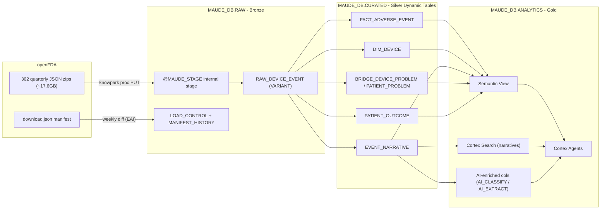

# MAUDE Ingestion + Clinician Cortex Agents - Design

Ingest the full FDA MAUDE device-adverse-event dataset into Snowflake via a native medallion pipeline (openFDA bulk JSON backfill + weekly incremental), profile the data, and stand up clinician-facing Cortex Agents for device safety intelligence.

- Target: `MAUDE_DB` (schemas `RAW`, `CURATED`, `ANALYTICS`), warehouse `MAUDE_WH`
- Scope: full historical (2009+), ongoing pipeline
- Source: openFDA bulk JSON (recommended), hybrid backfill + weekly incremental

---

## 1. Dataset facts

Verified against the live openFDA manifest (`https://api.fda.gov/download.json`, export 2026-07-22):

| Attribute | Value |
|---|---|
| Endpoint | `device/event` (MAUDE core) |
| Records | 25,368,161 |
| Partition files | 362, partitioned by quarter (`device/event/2004q3/device-event-0001-of-0001.json.zip`) |
| Compressed size | ~17.6 GB (zipped JSON) |
| Refresh cadence | Weekly |
| License | CC0 / public domain |

Each record is a **pre-joined MDR** (Medical Device Report): master event + `device[]` + `patient[]` + `mdr_text[]` (narrative), plus an `openfda` annotation block (`product_code`, `medical_specialty_description`, `device_class`, `regulation_number`, k-number). That annotation is the key advantage of the JSON path - it gives clinician-relevant device classification without extra joins.

Recent quarters get re-published as late/supplemental reports arrive, so incremental must **re-load changed partitions**, not just append new ones.

### Governance notes
- FOIA redactions appear inline as `(b)(4)` (trade secret) and `(b)(6)` (patient/personnel).
- FDA disclaimer: MAUDE is passive surveillance and must **not** drive individual patient-care decisions. It cannot establish event rates or causation. Use is limited to device-level postmarket surveillance. Agents must surface this.

---

## 2. Source path recommendation

**Recommended: hybrid on openFDA bulk JSON.** Backfill from the 362 quarterly zips; incremental via weekly manifest diff.

| Option | Verdict | Reason |
|---|---|---|
| openFDA bulk JSON | **Chosen** | Pre-joined event+device+patient+text, plus `openfda` device classification. One VARIANT row per MDR. |
| Raw pipe-delimited files | Rejected | Requires reconstructing a 6-way join across `mdrfoi`/`foidev`/`patient`/`foitext`/problem-code files; Latin-1 encoding; embedded `\|` in narratives; no `openfda` enrichment. |
| Pure REST API | Rejected | `skip` caps at 26k rows and rate limits make a 25.4M-row backfill impractical. Bulk zips are the sanctioned full-history path. |

---

## 3. Architecture

---

## 4. Implementation steps

### Step 1 - Provision environment
Create `MAUDE_DB` with schemas `RAW`, `CURATED`, `ANALYTICS`; warehouse `MAUDE_WH` (start MEDIUM for the ~17.6 GB backfill, then a serverless/XS lane for incremental). Create External Access Integration + network rule allowing `download.open.fda.gov` and `api.fda.gov`. Roles: `MAUDE_ENGINEER` (build/load), `MAUDE_CLINICIAN` (read-only ANALYTICS + agent usage).

### Step 2 - RAW (Bronze) layer
- Internal stage `@RAW.MAUDE_STAGE` (directory table on).
- `RAW_DEVICE_EVENT` (VARIANT + `_partition`, `_export_date`, `_loaded_at`, `_src_file`).
- Control tables `LOAD_CONTROL` (partition, record_count, export_date, status, load_ts) and `MANIFEST_HISTORY` (raw manifest snapshot per run).
- JSON files are `{"meta":..,"results":[...]}` - load with `STRIP_OUTER_ARRAY` off and `LATERAL FLATTEN(results)` into one VARIANT row per MDR.

### Step 3 - Backfill loader (Snowpark Python stored proc)
`SP_MAUDE_BACKFILL()`: read manifest, iterate the 362 event partitions, stream each zip via EAI, `PUT` to stage, `COPY INTO RAW_DEVICE_EVENT` flattening `results`, upsert `LOAD_CONTROL`. Idempotent per partition (delete-by-`_partition` then reload) so reruns are safe. Batch/loop to bound memory; run once for history.

### Step 4 - Incremental pipeline
`SP_MAUDE_SYNC()`: pull manifest, diff `export_date` + per-partition `records` vs `LOAD_CONTROL`, reload only changed/new quarter partitions (idempotent), snapshot manifest. Wrap in serverless `TASK_MAUDE_WEEKLY` (weekly schedule). Downstream layers refresh automatically via Dynamic Table `TARGET_LAG` and Cortex Search lag - no manual reprocessing.

### Step 5 - CURATED (Silver) star schema as Dynamic Tables
Incremental refresh, `TARGET_LAG='24 hours'`, grain reconstructed from the VARIANT:

- **`FACT_ADVERSE_EVENT`** (grain = `mdr_report_key`): event_type, date_received, date_of_event, report_source_code, reporter_occupation, adverse_event_flag, product_problem_flag.
- **`DIM_DEVICE`** (flatten `device[]`): brand_name, generic_name, manufacturer_d_name, model, product_code, `openfda.device_class`, `openfda.medical_specialty_description`, `openfda.regulation_number`.
- **`V_DEVICE_PRIMARY`** (view over DIM_DEVICE): one row per MDR (lowest device_sequence_number). Feeds the semantic view so metrics can be sliced by brand/product_code/manufacturer without fanout.
- **`EVENT_NARRATIVE`** (flatten `mdr_text[]`): mdr_report_key, **`mdr_text_key`** (FDA-assigned unique key per narrative segment), text_type_code, `text` (clinical narrative) + `redaction_flag` derived from `(b)(4)`/`(b)(6)` presence. Note the grain: an MDR carries many segments, so `mdr_report_key` is **not** unique here and neither is `(mdr_report_key, text_type_code)`.
- **`PATIENT_OUTCOME`** (flatten `patient[]`) and **`BRIDGE_DEVICE_PROBLEM`** (problem codes).
- **`V_PATIENT_PRIMARY`** (view over PATIENT_OUTCOME): one row per MDR (normalizes blank patient_sex to 'Unknown'). Feeds the semantic view.

The MDR-grain views (`V_DEVICE_PRIMARY`, `V_PATIENT_PRIMARY`) exist because a semantic view can only slice metrics by dimensions on the "one" side of a relationship. DIM_DEVICE is many-to-one with events (~17K reports name multiple devices); collapsing to primary device loses ~0.007% of distinct brand information.

### Step 6 - Data profiling
Snowflake Notebook `01_maude_profiling.ipynb` + companion SQL producing:
- Total rows and rows/quarter growth trend.
- Null-rate per key field (event_type, date_received, product_code, brand_name, manufacturer, patient outcome).
- Cardinality (distinct product_code, brand, manufacturer, medical_specialty).
- Event_type distribution (Death / Injury / Malfunction), device_class, report_source.
- Narrative length distribution + % usable + **redaction rate**.
- Date coverage and reporting lag (`date_of_event` -> `date_received`).
- `mdr_report_key` uniqueness.

Attach DMFs (freshness, row_count, null_count, unique) on `FACT_ADVERSE_EVENT` for ongoing monitoring. Use `visualize_data` for the key distributions.

### Step 7 - ANALYTICS (Gold) layer
- **Semantic view** (`MAUDE_SAFETY_SV`) over the star schema using the MDR-grain views: events (CHILD) references devices/patients (PARENTS) so event metrics can be sliced by brand/product_code/manufacturer/specialty without fanout. Problems stays as a child of events with its own `affected_report_count` metric.
- **Cortex Search service** (`MAUDE_NARRATIVE_SEARCH`) over narratives (attributes: `mdr_text_key`, mdr_report_key, report_number, product_code, brand_name, event_type, citation_title, source_url). Citations are keyed on **`mdr_text_key`** — the corpus is narrative-segment grain, so keying on `mdr_report_key` (or the derived `source_url`, which is a pure function of it) collapses ~54% of rows into duplicate ids and mis-attributes results. `source_url` remains an attribute for click-through to the openFDA API record (`api.fda.gov/device/event.json?search=mdr_report_key:<key>`), just not as the id. TARGET_LAG 1 day.
- **AI enrichment** (cost-bounded): `AI_CLASSIFY` for failure-mode / severity taxonomy, at narrative-segment grain (`mdr_text_key`). Table DDL is created in `04_analytics.sql` but **populated separately in `08_enrichment.sql` after the backfill completes** — `04_analytics.sql` runs while lanes are still loading, so sampling there would classify a near-empty corpus. `08_enrichment.sql` self-guards on a minimum corpus size. Gate with Cortex Code cost controls.

### Step 8 - Clinician Cortex Agents
Frame = device safety intelligence, not patient care. Build the top 2 first, then optionally 3-4.

1. **Device Safety Profile Agent** (build first): Cortex Analyst (semantic view) + Cortex Search (narratives, cited by `mdr_report_key`) + `data_to_chart` for trend/comparison visuals. Example: "What malfunctions have been reported for the [X] valve/pump in the last 3 years, and what patient outcomes were noted?"
2. **Failure-Mode Narrative Search Agent** (build first): Cortex Search-led RAG over 25M narratives. Example: "Find reports describing catheter tip fracture during retrieval." Returns cited MDRs.
3. **Comparative Device Risk Agent** (optional): compare event-type/problem-code distribution across devices sharing a product_code (procurement/formulary).
4. **Emerging Signal / Trend Agent** (optional): time-series spike detection by product_code/problem_code for safety officers and clinical engineering.

As-built, both agents ship with starter `sample_questions` and pin `MAUDE_WH` via each tool's `execution_environment`. Citations are keyed on `mdr_text_key` (unique per narrative segment), use `citation_title` (composite: "brand - event_type, year") as the display label, and carry `report_number` plus a clickable `source_url` (openFDA API record keyed on `mdr_report_key`). Response instructions tell the agent to surface these in every cited report. Every agent's response template must include the FDA disclaimer (MAUDE cannot establish rates/causation; not for individual care decisions) and cite MDR keys. RBAC: `MAUDE_CLINICIAN` gets read-only on ANALYTICS + agent usage only.

---

## 5. Parallel backfill (as-built)

The initial serial backfill (one proc looping 362 partitions) is slow because each
partition's HTTP download + `ijson` parse runs single-node in Python - a larger
warehouse cannot speed a single lane. Backfill is therefore fanned out across
**~43 disjoint time-bucket serverless task lanes** (`TASK_MAUDE_BF_*`), each an
XSMALL task calling `SP_MAUDE_INGEST('BACKFILL', 0, '<regex>')`. Older/lighter years
are grouped; the heavy recent years (2019+) are split **per quarter** so the largest
lane is ~1 quarter (~6 files) rather than ~1 year (~24) - this flattens the tail.

- Parallelism comes from many cheap XSMALL lanes, not big warehouses.
- `QUARTER_LIKE` accepts a regex with alternation, e.g. `(2005|2006|2007|2008)q%`.
- Lanes never collide: `BACKFILL` skips already-`LOADED` partitions (idempotent).
- Snowpark async (`AsyncJob`) was rejected - it parallelizes SQL submission, not
  the Python download bottleneck.
- Teardown: `DROP` the `TASK_MAUDE_BF_*` lanes once the backfill completes.

**Measured (first run, 25.37M rows / 362 partitions):** the 18-lane year-level
version loaded the full history in **~43 min** wall-clock (peak 18-22 partitions/min)
vs an extrapolated **~6 h** serial (~1 partition/min) - roughly **8x**. The tail was
bound by the biggest single-year lane, which is why the checked-in version now splits
heavy years by quarter.

---

## 6. Verification

- **Load integrity:** `COUNT(*) FROM RAW.RAW_DEVICE_EVENT` reconciles to
  `SUM(loaded_records)` in `LOAD_CONTROL` and to the manifest `total_records`
  (~25.37M as of 2026-07-22, within weekly refresh drift).
- **Grain:** `FACT_ADVERSE_EVENT` has no duplicate `mdr_report_key`; child flatten
  counts (device/narrative/patient/problem) are >= fact rows. Validated on the
  2010q1 partition: 64,517 rows loaded == manifest count.
- **Dynamic Tables:** show current numbers only after they refresh (TARGET_LAG
  1 day); force with `ALTER DYNAMIC TABLE ... REFRESH` or let them settle after
  backfill.
- **Incremental:** run `SP_MAUDE_INGEST('SYNC',0,NULL)` twice - the second run
  loads 0 partitions (no false diffs).
- **DMFs** attached on `FACT_ADVERSE_EVENT` (row count, duplicate, null) evaluate
  on the daily schedule.
- **Cortex Search** returns cited MDRs (validated: "trocar seal leaking" -> Endopath
  trocar malfunction reports). **Cortex Analyst** answers event-type counts.
- **RBAC:** `MAUDE_CLINICIAN` reads ANALYTICS + agents only, not RAW/CURATED.

---

## 7. Files (as-built) and runbook

Run in order as `MAUDE_ENGINEER` (00 needs ACCOUNTADMIN for the EAI / task grants).

These are Jinja templates. Render them first with `assets/renderer/render.py`
(see `skills/maude-deploy/SKILL.md`), then execute the emitted `.sql` in this
order — which is `assets/build_manifest.yaml` `depends_on` order:

| File | Purpose |
|---|---|
| `assets/templates/00_setup.sql.j2` | DB/schemas/warehouse, roles, EAI + network rule, task-exec grants |
| `assets/templates/01_raw.sql.j2` | stage, JSON file format, `RAW_DEVICE_EVENT`, `LOAD_CONTROL`, `MANIFEST_HISTORY` |
| `assets/templates/02_ingest.sql.j2` | `SP_MAUDE_INGEST` (backfill+sync), `TASK_MAUDE_WEEKLY_SYNC`, `TASK_MAUDE_BACKFILL` |
| `assets/templates/03_curated.sql.j2` | star schema Dynamic Tables (fact/dims/narrative/patient/problem bridge) |
| `assets/templates/04_analytics.sql.j2` | `V_NARRATIVE_ENRICHED`, semantic view `MAUDE_SAFETY_SV`, Cortex Search `MAUDE_NARRATIVE_SEARCH`, `AI_EVENT_ENRICHMENT` DDL, clinician grants |
| `assets/templates/08_enrichment.sql.j2` | Populates `AI_EVENT_ENRICHMENT` with a bounded `AI_CLASSIFY` sample. **Must run after the backfill completes** — guarded on minimum corpus size |
| `assets/templates/05_agents.sql.j2` | `MAUDE_DEVICE_SAFETY_AGENT` + `MAUDE_FAILURE_MODE_AGENT` + grants |
| `assets/templates/06_profiling.sql.j2` | profiling queries + DMFs |
| `assets/templates/07_backfill_fanout.sql.j2` | parallel backfill launcher (lane count set by `load_scope`) + teardown |

Not shipped in this plugin (they live in the source repo): a Snowflake Workspace
profiling notebook and the pipeline architecture diagram.

The notebook is deployed as Snowsight notebook `MAUDE_DB.ANALYTICS.MAUDE_PROFILING`
(staged in `@MAUDE_DB.ANALYTICS.NOTEBOOKS`, warehouse `MAUDE_WH`). Redeploy after
edits with: `PUT file://.../01_maude_profiling.ipynb @MAUDE_DB.ANALYTICS.NOTEBOOKS/maude_profiling OVERWRITE=TRUE`
then `ALTER NOTEBOOK MAUDE_DB.ANALYTICS.MAUDE_PROFILING ADD LIVE VERSION FROM LAST;`

**Backfill options:** single async task (`EXECUTE TASK TASK_MAUDE_BACKFILL`) or, for
speed, the parallel lanes in `07_backfill_fanout.sql`. **After backfill:** resume
ongoing sync with `ALTER TASK MAUDE_DB.RAW.TASK_MAUDE_WEEKLY_SYNC RESUME;` and drop
the `TASK_MAUDE_BF_*` lanes.
