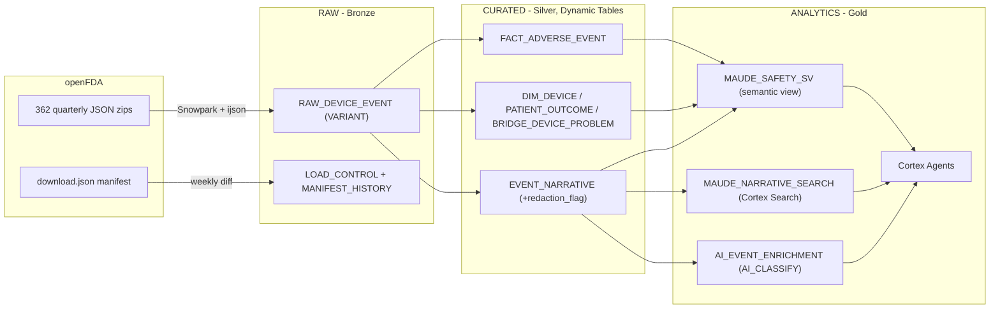

# FDA MAUDE on Snowflake

A Snowflake-native pipeline that ingests the full FDA **MAUDE** (Manufacturer and User
Facility Device Experience) device adverse-event dataset, curates it into an analytics-ready
star schema, and exposes it to clinical and quality teams through **Cortex Analyst** (semantic
view), **Cortex Search** (narrative RAG), and two clinician-facing **Cortex Agents**.

- **Source:** openFDA `device/event` bulk JSON (public domain, CC0), ~25.4M medical device
  reports (MDRs), 362 quarterly partitions (~17.6 GB compressed), refreshed weekly.
- **Load:** parallel historical backfill + weekly incremental sync, both idempotent.
- **Serving:** semantic view, Cortex Search over ~58M narrative segments, Cortex Agents.

> **Governance note.** MAUDE is a *passive surveillance* system. Report counts cannot establish
> event rates, incidence, or causation, and must not drive individual patient-care decisions.
> Everything here is scoped to **postmarket device-safety intelligence**. Agent responses carry
> this disclaimer and cite MDR report keys. FOIA redactions (`(b)(4)` trade secret, `(b)(6)`
> patient/personnel) are flagged, not hidden.

---

## Architecture

Medallion layout in `MAUDE_DB`:

| Layer | Schema | Contents |
|---|---|---|
| Bronze | `RAW` | Staged JSON landed as VARIANT (1 row/MDR), load-control + manifest ledgers |
| Silver | `CURATED` | Typed star schema as Dynamic Tables (1-day lag) |
| Gold | `ANALYTICS` | Semantic view, Cortex Search service, AI enrichment, agents |

Key data models (`CURATED`):

- `FACT_ADVERSE_EVENT` - one row per MDR (`mdr_report_key`): event type, dates, reporting lag, source.
- `DIM_DEVICE` - device brand/manufacturer/model/product code + openFDA classification (device class, medical specialty, regulation number).
- `V_DEVICE_PRIMARY` - one row per MDR (primary device), feeds the semantic view for dimension slicing without fanout.
- `EVENT_NARRATIVE` - free-text reporter + manufacturer narratives, with `redaction_flag` and `mdr_text_key` (FDA-assigned unique id per narrative segment; one MDR has many segments).
- `PATIENT_OUTCOME` - patient sex/age/weight and coded outcomes.
- `V_PATIENT_PRIMARY` - one row per MDR (normalizes blank patient_sex), feeds the semantic view.
- `BRIDGE_DEVICE_PROBLEM` - product-problem codes per report.

---

## How it loads

- **Ingest proc** `SP_MAUDE_INGEST(mode, max_partitions, quarter_like)` handles both
  `BACKFILL` and incremental `SYNC`. It stream-parses each partition (`ijson` -> NDJSON) so a
  single MDR never hits the 16 MB VARIANT limit, and lands one VARIANT row per report.
- **Incremental** `TASK_MAUDE_WEEKLY_SYNC` diffs the openFDA manifest weekly and reloads only
  changed/new partitions (late and supplemental reports).
- **Backfill** runs as parallel serverless task lanes bucketed by time period (heavy recent
  years split per quarter) - the proc is single-node Python, so parallelism comes from many
  cheap XSMALL lanes, not a bigger warehouse.
- Every partition outcome is recorded in `LOAD_CONTROL`; `RAW` row count reconciles to the
  manifest total.

### Run order

These are Jinja templates \u2014 render with `assets/renderer/render.py` first, then
execute the emitted `.sql` in this order (see `skills/maude-deploy/SKILL.md`).

| File | Purpose |
|---|---|
| `assets/templates/00_setup.sql.j2` | DB/schemas/warehouse, roles, External Access Integration, task grants |
| `assets/templates/01_raw.sql.j2` | stage, JSON file format, RAW table + control tables |
| `assets/templates/02_ingest.sql.j2` | `SP_MAUDE_INGEST`, weekly sync task, one-off backfill task |
| `assets/templates/03_curated.sql.j2` | star schema Dynamic Tables |
| `assets/templates/04_analytics.sql.j2` | semantic view, Cortex Search, AI enrichment DDL, clinician grants |
| `assets/templates/08_enrichment.sql.j2` | Populates `AI_EVENT_ENRICHMENT` (bounded `AI_CLASSIFY` sample) - run **after** the backfill |
| `assets/templates/05_agents.sql.j2` | the two clinician Cortex Agents + grants |
| `assets/templates/06_profiling.sql.j2` | profiling queries + Data Metric Functions |
| `assets/templates/07_backfill_fanout.sql.j2` | parallel backfill launcher + teardown |

Then: run backfill (single task or `07` fan-out), and once complete
`ALTER TASK MAUDE_DB.RAW.TASK_MAUDE_WEEKLY_SYNC RESUME;` for ongoing weekly updates.

See [DESIGN.md](DESIGN.md) for the full design, tradeoffs, and measured timings.

---

## Roles

- `MAUDE_ENGINEER` - builds and loads the pipeline; owns `MAUDE_DB`.
- `MAUDE_CLINICIAN` - read-only on `ANALYTICS` + agent usage only. No access to RAW/CURATED.

---

## Personas (med device companies)

| Persona | What they need MAUDE for |
|---|---|
| Postmarket Surveillance / Complaint Handling | Trend detection, reportability decisions, PSUR/PMSR inputs |
| Quality / CAPA engineer | Real-world failure modes for root-cause and corrective action |
| R&D / Design engineer | Known-harm inputs for design FMEA and ISO 14971 risk files |
| Regulatory Affairs | Historical event evidence for 510(k)/PMA, EU MDR CER/PMCF |
| Clinical / Medical Affairs | Cited answers to "what's reported about device X" for HCP inquiries |
| Clinical / Field Safety officer | Emerging-signal monitoring and escalation |
| Procurement / Value Analysis | Objective device-safety comparison across alternatives |

---

## Use cases

| Use case | How it works here | Consuming assets |
|---|---|---|
| **Signal detection & trending** | Event-type / problem-code counts by product code over time | Semantic view, trend queries |
| **Failure-mode discovery** | Semantic search over ~58M narratives, returns cited MDRs | Cortex Search + Failure-Mode agent |
| **Complaint triage / classification** | `AI_CLASSIFY` narratives into failure-mode + severity buckets | `AI_EVENT_ENRICHMENT` (one row per narrative segment) |
| **Predicate / competitive benchmarking** | Compare same-product-code devices on event mix (as counts) | Semantic view |
| **Regulatory & CER evidence** | Historical adverse-event picture for a product code, with citations | Semantic view + Cortex Search |
| **Risk management (ISO 14971)** | Quantify known harms/hazards by device type from real-world reports | Semantic view + narratives |
| **HCP / medical inquiry response** | "What's reported about device X, and outcomes?" | Device Safety Profile agent |
| **Value analysis committee support** | Device-safety view across procurement alternatives | Comparative Device Risk agent |

### Agents (built)

- **Device Safety Profile Agent** - Cortex Analyst (semantic view) + Cortex Search (narratives)
  + `data_to_chart` for visualizing trends and comparisons. Answers quantitative safety
  questions and pulls supporting cited reports.
- **Failure-Mode Search Agent** - Cortex Search-led RAG over narratives. Finds and summarizes
  reports matching a specific failure mode or clinical presentation, with MDR citations.

Both ship with starter **sample questions**, pin the `MAUDE_WH` warehouse via each tool's
`execution_environment`, frame results as postmarket surveillance, and append the FDA disclaimer.

Each citation includes:
- **`mdr_report_key`** - the FDA's canonical MDR identifier (join key across the whole schema).
- **`report_number`** - the human-readable MDR number shown in the MAUDE web UI.
- **`citation_title`** - composite label: `brand_name - event_type, year`.
- **`mdr_text_key`** - the citation **id**. FDA-assigned and unique per narrative segment. The search corpus is segment grain, so `mdr_report_key` is not unique in it (~54% of rows share one) and cannot serve as the id without collapsing or mis-attributing citations.
- **`source_url`** - clickable link to the openFDA API record for verification (`https://api.fda.gov/device/event.json?search=mdr_report_key:<key>&limit=1`). Uses the API instead of the cfMAUDE web page because the web detail page has coverage gaps for older records. This is a display/verification attribute only, **not** the id - it is derived purely from `mdr_report_key` and inherits its non-uniqueness.

### Sample questions

**Structured (Cortex Analyst / semantic view)** - counts, trends, breakdowns:

- How many malfunction reports were filed for infusion pumps in the last 3 years?
- Compare death, injury, and malfunction report counts for coronary stents by year.
- Which manufacturers have the most adverse-event reports for surgical staplers?
- What are the top product-problem codes for insulin pumps?
- Show the trend of reports for a given product code over time.

**Unstructured (Cortex Search / narratives)** - failure modes, cited reports:

- Find reports describing catheter tip fracture during retrieval.
- What failure modes are described for infusion pump software errors?
- Show reports mentioning lead insulation failure in pacemakers.
- Find narratives describing device migration after implantation.
- What do reports say about balloon rupture during angioplasty?

**Hybrid (structured + unstructured together)** - the agent runs the semantic view for the
numbers and Cortex Search for the narrative evidence, then reconciles them:

- How many malfunction reports were filed for insulin pumps last year, and what failure modes do the narratives most often describe?
- Which product code has the most death reports, and summarize what those narratives say happened?
- Compare injury vs malfunction counts for coronary stents by year, then pull example narratives from the year with the biggest spike.
- For the manufacturer with the most surgical-stapler reports, what problems do the narratives describe and what patient outcomes were noted?
- How many reports mention device migration for a given product code, and what were the reported patient outcomes?

---

## Profiling notebook

`notebooks/01_maude_profiling.ipynb` - a container-runtime Workspace notebook (Plotly +
matplotlib) covering load status, volume by year, event-type distribution, top medical
specialties, event-type mix over time, and FOIA redaction rate. Installs Plotly from the
Snowflake-managed PyPI repo via an inline `!pip install` cell.

---

## Data source & license

FDA openFDA `device/event`. Public domain / CC0. See
[open.fda.gov/data/maude](https://open.fda.gov/data/maude/). Not affiliated with or endorsed
by the FDA.
