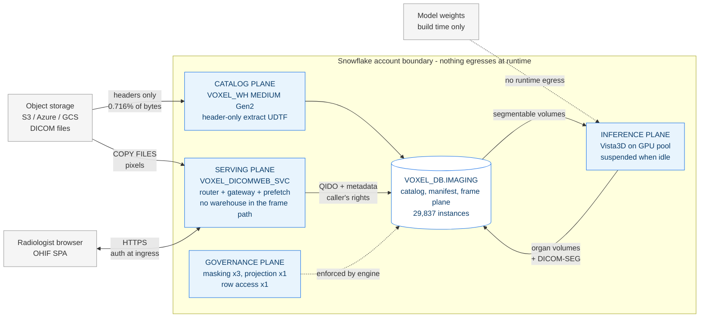
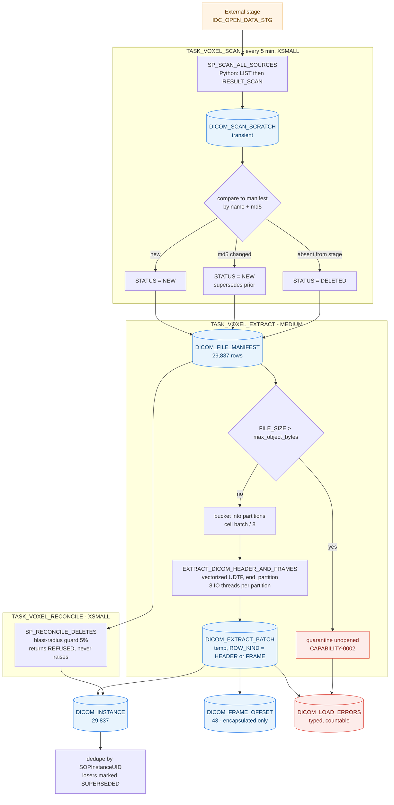
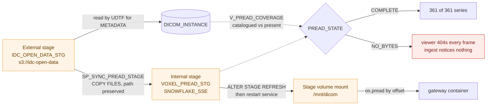
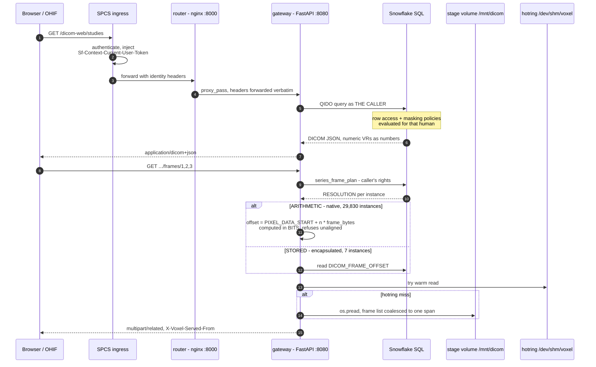
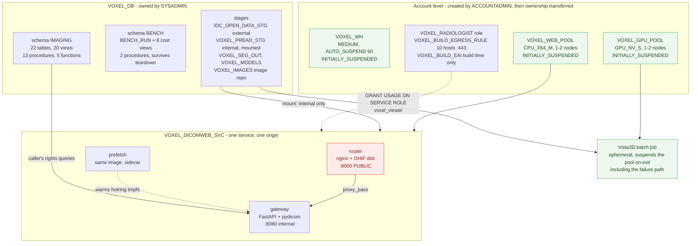
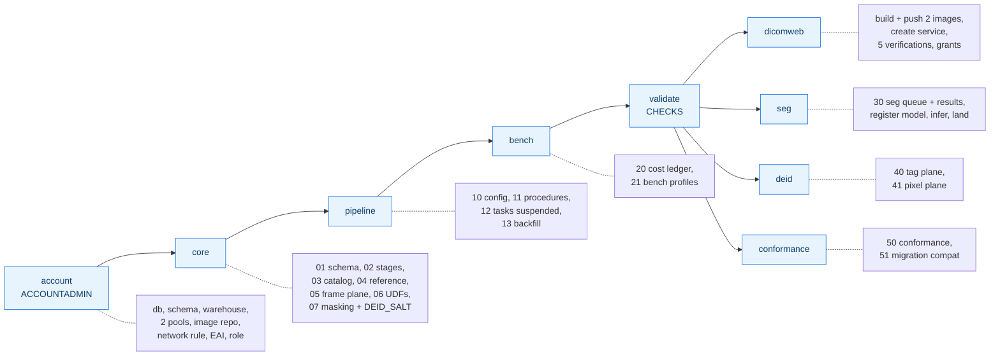
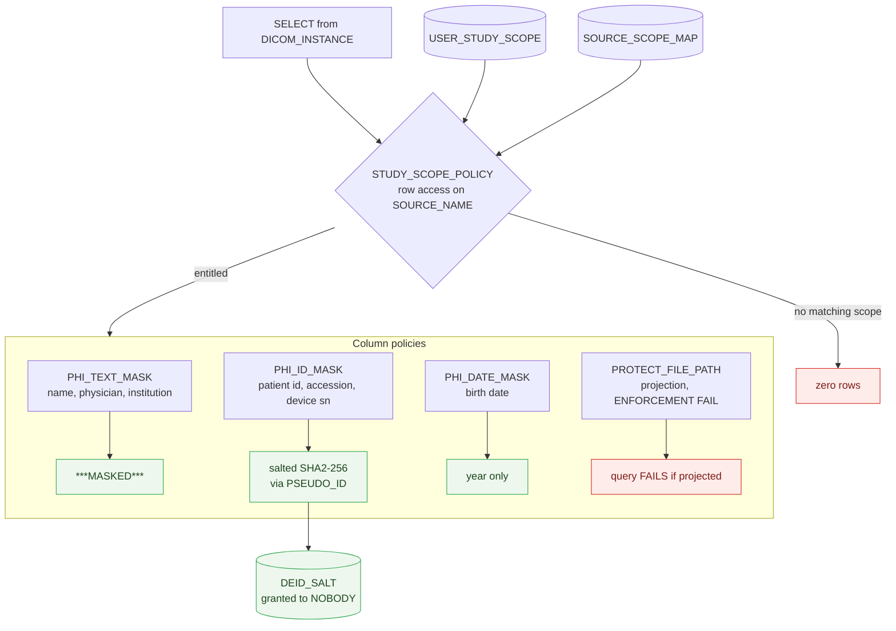
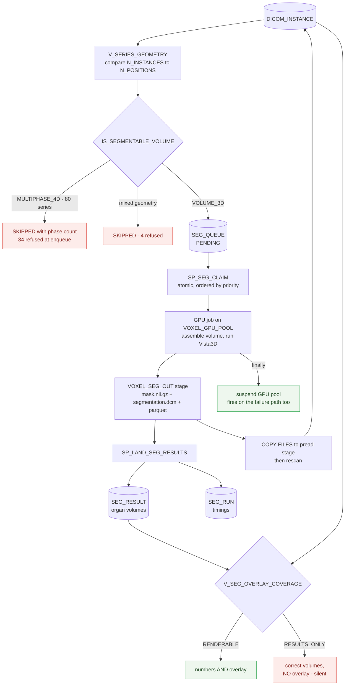
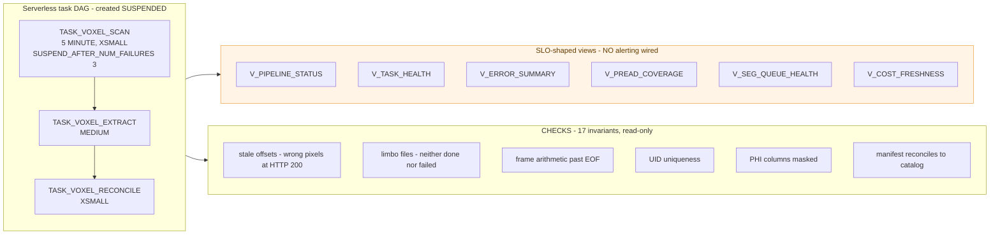

# Architecture

End-to-end architecture of the Snowflake for Medical Imaging platform, as deployed and
verified in the development account on 2026-08-10. Every object named here was
read back out of `INFORMATION_SCHEMA` and `SHOW`, not transcribed from the
templates.

Data model is in [DATA_MODEL.md](DATA_MODEL.md).

Deployed surface, counted from `INFORMATION_SCHEMA`: **26 tables** (22 by design
in `IMAGING`, 1 in `BENCH`, plus 3 scratch tables that are residue -- see
DATA_MODEL section 6), **28 views** (20 + 8), **15 procedures** (13 + 2),
**5 functions**, 5 stages, 3 tasks, 1 SPCS service with 3 containers, 2 compute
pools, 10 policy attachments.

---

## 1. System context

What the thing is, and where the boundary sits. Nothing crosses the account
boundary except the browser session.

**The load-bearing property:** the serving plane never touches a warehouse to
return pixels. Frames are a positioned read against a mounted stage volume. The
warehouse is only in the path for catalog queries.

---

## 2. Ingest: metadata path

One pass per file, header only. This is where the 0.716% comes from.

**Why the UDTF is partitioned:** a vectorized `process` is 1-to-1 so it cannot
emit N frame rows per file. `end_partition` can, and it requires `PARTITION BY`
on a real column, which is why the bucket is materialized rather than computed
inline. Bucket count derives from the actual batch size, not the configured
limit.

**Failures are rows, not poisoned cells.** `DICOM_LOAD_ERRORS` joins to
`DICOM_ERROR_CATALOG` so every failure carries a class, a severity, a retryable
flag and a runbook step. `COUNT(*) GROUP BY ERR_CODE` is an answerable question,
which it is not when failures are written into a metadata column.

---

## 3. Ingest: pixel path

**Metadata and pixels come from different stages.** This is the single most
counter-intuitive thing in the build, and getting it wrong produces a catalog
that is 100% healthy and serves zero pixels.

SPCS stage volumes mount **internal stages only**, so the external stage the
catalog is built from cannot be mounted. Both must be populated. `DIRECTORY()`
is stale after an out-of-band upload, hence the mandatory `REFRESH`.

---

## 4. Read path: how a frame is served

**Offsets are never the authorization token.** They are only ever produced as a
side effect of a policy-enforced read, so a caller who cannot see a study cannot
obtain its byte layout. There is no presigned-URL path handing coordinates to the
client.

**A 404 is deliberately ambiguous** between "does not exist", "you cannot see it"
and "excluded as unservable".

---

## 5. Deployment topology

Cost-relevant facts baked into the topology:

- Both pools are created `INITIALLY_SUSPENDED`, which is **not** the default. A
  pool created the default way provisions `MIN_NODES` immediately and idle-bills.
  `00_ACCOUNT_SETUP` asserts `BILLING_CHECK = OK`.
- The EAI exists for image builds and is **not attached to the running service**,
  so `external_access_integrations = null` is a provable claim from
  `DESCRIBE SERVICE`, not an assertion.
- Exactly one endpoint is public. A second public endpoint would put the SPA and
  its data source on different origins, and the ingress baseline CSP
  `connect-src 'self'` hard-blocks that. CORS cannot loosen it.

---

## 6. Deploy order

Phases after `validate` are independent of each other. `deid` carries an abort
gate: if any DICOM-SEG instance is catalogued while the four SEG-defining
sequence tags are unclassified, it **refuses to attach** the VARIANT masking
policy rather than blind the viewer.

Rendering is a pure text transform. `assets/renderer/render.py` reads
`build_manifest.yaml` plus `config.json` and writes one SQL file per object, with
`StrictUndefined` so a missing config key fails at render time instead of
emitting `None` into a `CREATE` statement.

---

## 7. Governance enforcement

**The salt is not in the policy body and not in the repository.** It is generated
at deploy time from `UUID_STRING()` into `DEID_SALT`, which is granted to no
role, and read through `PSEUDO_ID`. Verified: a role with `SELECT` on the table
but no grant on `DEID_SALT` and no `USAGE` on `PSEUDO_ID` still reads the masked
column correctly, because **masking policy bodies resolve their references with
the policy owner's rights**. The same role cannot read the salt and cannot call
the function as a brute-force oracle.

Test negative cases with `USE SECONDARY ROLES NONE`. An interactive session has
secondary roles active and will authorize through an inherited role, handing you
a false negative.

Known limits, stated rather than implied: `PROTECT_FILE_PATH` protects against
analysts and BI building a bulk export path, **not** against the viewer role,
which must be allowlisted because the gateway resolves frames by selecting
`FILE_NAME` under caller's rights. `MASK_RAW_METADATA` is currently detached, so
`PHI_RAW_METADATA_UNMASKED` reports WARN.

---

## 8. Segmentation loop

**Two independent write paths.** `SEG_RESULT` is written from the batch job's
parquet; the viewer renders from `DICOM_INSTANCE`. A series can report correct
organ volumes through every SQL surface and show no overlay at all.
`V_SEG_OVERLAY_COVERAGE` is the join that detects it.

`SEG_RESULT` idempotency is keyed on `(series, MODEL_VERSION)`, so re-running
under a new version leaves both generations. Any per-series aggregate must use
`COUNT(DISTINCT STRUCTURE_ID)` or it reports twice the organ count, which reads
as an anatomical claim.

---

## 9. Orchestration and observability

`SUSPEND_TASK_AFTER_NUM_FAILURES` is root-only. `SP_RECONCILE_DELETES` returns a
`REFUSED:` string rather than raising, specifically so a refusal cannot count
toward that failure budget.

Six views are shaped like SLOs and **nothing alerts on them.** That is a real
gap, not a design choice.

---

## 10. What this deliberately does not do

| Not done | Why |
|---|---|
| STOW-RS writes | Returns 501. A write endpoint that accepts and discards is worse than one that says no |
| Server-side transcode | Safari lacks `credentialless` COEP so it gets single-threaded decode. A transcode path means decoding PHI in the serving container |
| Presigned browser-direct frame fetch | Hands the client coordinates to bypass authorization and holes the ingress access history |
| Hybrid Tables for the offset hot path | ~16k ops/sec per database shared with everything else, no incremental primitive maintains it |
| Iframe embed in Epic or Cerner | The proxy force-sets `X-Frame-Options: DENY`. Use SMART-on-FHIR launch-out |
| Runtime egress | No EAI attached to the serving service, so it is provable rather than promised |
| Alerting | Six SLO views exist, nothing pages |
| Enforcement of `V_PIXEL_SERVABILITY` | Advisory only. An advisory view mistaken for a control is its own risk |
