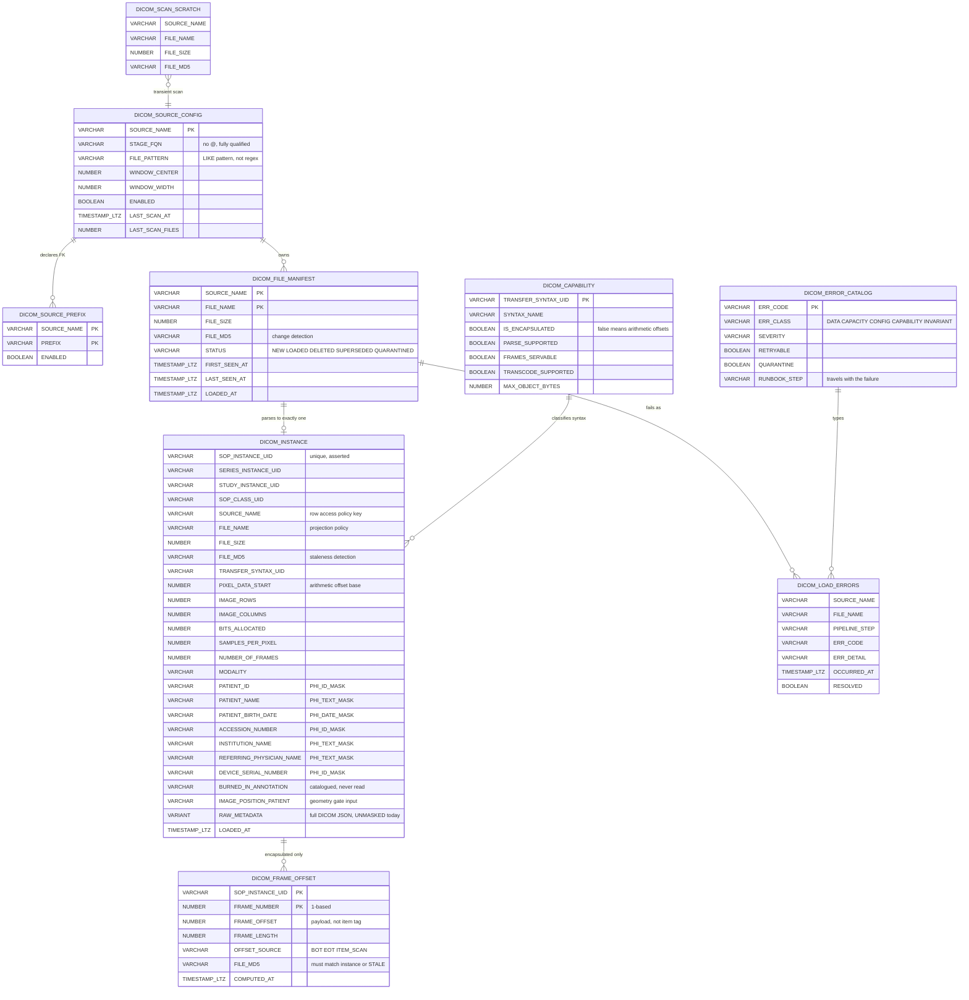
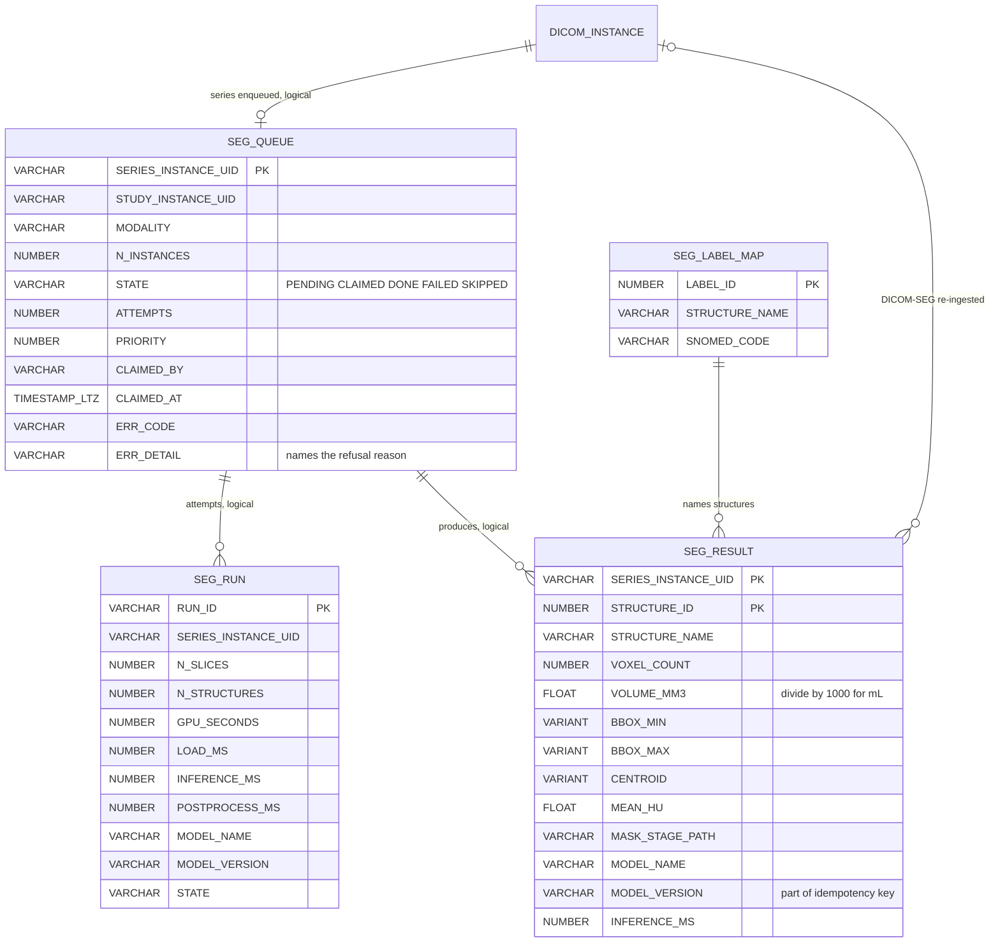
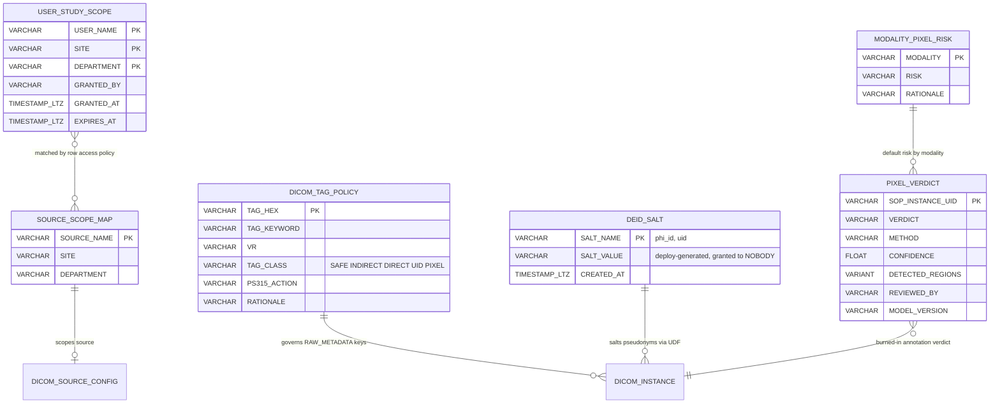
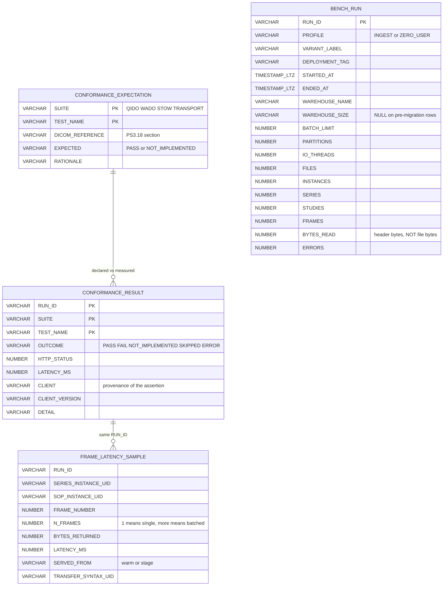
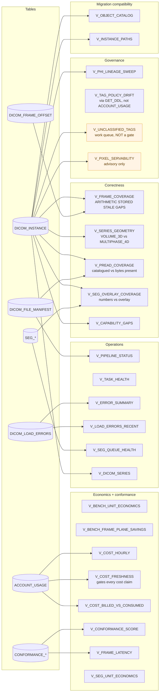

# Data model

The 26 tables in the deployed schema -- 22 by design in `IMAGING`, 1 in `BENCH`,
and 3 scratch tables that are residue (section 6) -- read back out of
`VOXEL_DB.INFORMATION_SCHEMA` rather than transcribed from the templates.
Row counts are live as of 2026-08-10 Pacific.

Architecture is in [ARCHITECTURE.md](ARCHITECTURE.md).

**One thing to know before reading the diagrams.** Only **one** foreign key is
actually declared in the schema: `DICOM_SOURCE_PREFIX.SOURCE_NAME` references
`DICOM_SOURCE_CONFIG`. Every other relationship shown is a **logical join
enforced by procedures and asserted by CHECKS**, not by a constraint. Snowflake
does not enforce foreign keys, so declaring more would create the appearance of
integrity that nothing upholds. Relationships below are marked accordingly.

---

## 1. Ingest core: manifest, catalog, frame plane

The spine. A file becomes a manifest row, then exactly one catalog row, then zero
or more frame-offset rows.

Live counts: manifest 29,837 / instances 29,837 / frame offsets **43** / errors 0.

`FILE_MD5` appearing in three tables is deliberate. It is how
`INVARIANT_0001_NO_STALE_OFFSETS` detects offsets computed against a file version
that no longer exists, which is the case that serves **the wrong pixels at HTTP
200**. Only 7 instances carry stored offsets; the other 29,830 resolve
arithmetically and store nothing.

---

## 2. Segmentation

Live: queue 192 rows (2 DONE, 151 PENDING, 39 SKIPPED), results 21, runs 2,
label map 8.

Two traps encoded here:

- **`SEG_RESULT` is keyed on `(series, STRUCTURE_ID)` but idempotency is keyed on
  `(series, MODEL_VERSION)`**, so a re-run under a new model version leaves both
  generations in the table. Per-series aggregates must use
  `COUNT(DISTINCT STRUCTURE_ID)`.
- **Joining `SEG_RESULT` to `DICOM_INSTANCE` on `SERIES_INSTANCE_UID` fans out**
  (structures x slices). Aggregate `SEG_RESULT` separately before joining.

Only 8 of Vista3D's label ids are mapped; anything else lands as `label_<id>`
rather than being dropped.

---

## 3. Governance and de-identification

Live: tag policy 60 rows, salts 2, scope 1 user / 3 sources, modality risk 15,
`PIXEL_VERDICT` **0 rows** so `V_PIXEL_SERVABILITY` reports `PRESUMED_CLEAN` by
default-deny logic.

`DEID_SALT` is the security-critical table. It carries no grants at all, and the
masking policy reaches it through `PSEUDO_ID` under the policy owner's rights.
Rotating a salt invalidates every previously issued pseudonym, by design.

`DICOM_TAG_POLICY` drives a generated `OBJECT_PICK` allowlist. **`OBJECT_PICK`
does not recurse** — it filters top-level keys only, so allowlisting a sequence
passes its entire nested payload including UIDs. That makes allowlisting a
sequence a much larger decision than allowlisting a scalar, and it is why
`MASK_RAW_METADATA` is currently detached.

---

## 4. Conformance and cost ledger

Live: expectations 40, results 356, latency samples 99, bench runs 3.

`CLIENT` on `CONFORMANCE_RESULT` records **provenance per assertion** —
`voxel-unit-tests` and `voxel-proxy-harness` are not the same evidence as a
third-party client over the wire. Conflating them is how a conformance statement
becomes worthless. Current posture: 32 MATCH / 8 UNTESTED / 0 MISMATCH.

`BYTES_READ` stores `SUM(PIXEL_DATA_START)`, i.e. header bytes only. Charging the
run the full file size would overstate I/O by roughly 140x on this corpus and
understate the exact advantage being measured.

`BENCH_RUN` lives in schema `BENCH`, which teardown clones to
`VOXEL_DB_BENCH_KEEP` before dropping the database.

---

## 5. View layer

Views by purpose. All 28 read from the tables above; none materialize.
20 live in `IMAGING`, 8 in `BENCH`.

`V_OBJECT_CATALOG` and `V_INSTANCE_PATHS` reproduce the incumbent's column
names and its `meta VARIANT` model so a migration is mostly a view swap. Stated
precisely: the incumbent writes `meta:['00100010']` and Snowflake needs
`meta['00100010']`, so it is a mechanical one-character edit per query, **not**
"queries run unchanged".

---

## 6. Schema residue worth cleaning

Three tables in `IMAGING` are **not part of the design** and appear in no
template. They are leftovers from expanding the corpus by hand:

| Table | Rows |
|---|---|
| `SCRATCH_IDC_LISTING` | 170,029 |
| `SCRATCH_IDC_SERIES` | 4,139 |
| `SCRATCH_IDC_PICK` | 348 |

They cost storage, they will confuse anyone reading the schema, and nothing
reconciles them. `DROP TABLE` is safe — no view, procedure or task references
them. They are excluded from the diagrams above deliberately.
